```mermaid
graph LR
    subgraph "Profile & Utilities"
        Abhigyan126 --> Custom_Low_Battery_Warning
        Abhigyan126 --> ForceDarkMode
        Abhigyan126 --> Clear_Comments
        Abhigyan126 --> Repository_Link
        Custom_Low_Battery_Warning -.-> ForceDarkMode
    end
    
    subgraph "Image Processing & CV"
        City_Segmentation --> DrishyaVastu
        City_Segmentation --> REM_MetaData
        DrishyaVastu -->  Frame_Fusion
        DrishyaVastu --> Eng_to_HIN_Translator
        Display_image --> REM_MetaData
        Facial_Recognition_Many_to_Many_ --> Make_FaceDB
        depth_estimation --> Frame_Fusion
        Road_Segmentation --> City_Segmentation
        OCR --> REM_MetaData
        Frame_Fusion -.-> PhotoDrop
    end

    subgraph "Web & Apps"
        FEEDBACK --> Newspaper_AI
        Gemini_wrapper --> FEEDBACK
        PhotoDrop --> HTTP_server
        Recipe_Repo --> Recipe_Repo_Python_FastAPI
        Real_estate --> Real_Estate_Management
        Newspaper_AI --> Newspaper_ai_React

    end

    subgraph "ML & AI"
        LLM_MEM --> Newspaper_AI
        LLM_MEM --> Prompt2query
        Gesture_Detection --> LLM_MEM
        Movie_recommendation --> LLM_MEM
        SimilarityMAP --> LLM_MEM
        RAG_Framework --> LLM_MEM
        Snake_DQN --> Track_DQN
        NuralNet --> Snake_DQN
        PandemicPulse --> LLM_MEM

    end

    subgraph "Other"
        Chunk -->  SIEVE
        search_algorithm --> Lagrange_interpolation
        Learning_management_system --> User_Authentication_System
        NextWord_txt --> LLM_MEM
        state --> HTTP_server
        Vector_Store --> RAG_Framework
        Packet_sniffer --> HTTP_server
    end
    
    style Abhigyan126 fill:#222,stroke:#333,stroke-width:2px
    style City_Segmentation fill:#222,stroke:#333,stroke-width:2px
    style FEEDBACK fill:#222,stroke:#333,stroke-width:2px
    style LLM_MEM fill:#222,stroke:#333,stroke-width:2px
    style Chunk fill:#222,stroke:#333,stroke-width:2px

    classDef default fill:#333,stroke:#fff,stroke-width:1px;
```

<table style="width: 100%; background-color: white; border-collapse: collapse;">
  <tr>
    <td>
      
👋 Welcome to My GitHub! Hi there! I’m passionate about exploring the endless possibilities of code. My repositories are a mix of serious projects, fun experiments, and everything in between. Whether it’s building something innovative or just playing around with an idea, this is where I bring my thoughts to life!

    </td>
  </tr>
  <tr>
    <td align="center">
      
    </td>
  </tr>
  <tr>
    <td> 

      
      

    </td>
  </tr>
  <tr>
    <td align="center" style="background-color: #ffffff; padding: 20px; border-radius: 15px; box-shadow: 0px 4px 6px rgba(0, 0, 0, 0.1);">
      
      
      
      
      
      
      
      
      
      
      
      
      
      
      
      
      
      
      
      
      
      
      
      
      
      
      
      
      
      
      
      
      
      
      
      
      
      
      
      
      
    </td>
  </tr>
  <tr>
    <td>
      
🌟 Take a Look Around Feel free to explore my repositories. Whether you're here for something serious or just curious, I hope you find something that sparks your interest!

    </td>
  </tr>
<tr>
<td>
  

</td>
</tr>
</table>

    <strong>Note:</strong> This graph is AI-generated and may give false information.

